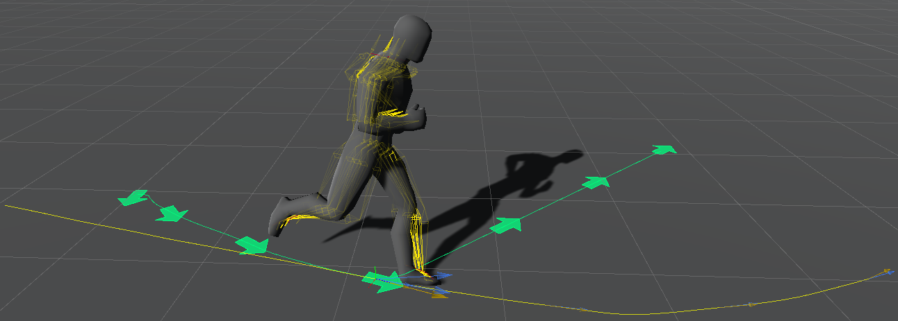

# Kinematica Concepts and Overview

Kinematica is a character animation system build around the concept of Motion Matching.

Motion Matching is an animation technique that does not require animation clips to be arranged in blend trees or state machines. Instead, given a skeletal pose and a desired trajectory movement it performs a nearest neighbor search in an unstructured library of related skeletal poses. The result of this search is now considered the continuation of the previous skeletal pose.

This [presentation](https://youtu.be/z_wpgHFSWss) contains a detailed explanation of the technical background of Motion Matching.

## Motion Library and Runtime Asset

Kinematica uses a pre-processing step to generate the runtime asset from the corresponding editor asset. See the [Asset Builder](Builder.md) section of this documentation for further details.

The pre-processing step samples all animation clips at the user defined target framerate to ensure a consistent sampling rate across the original individual animation clips. The asset builder only samples the ranges that contain any tags. Tags and markers are a concept that allows to associate user defined semantic trait with sequences and individual animation poses respectively. See the [Asset Builder](Builder.md) section of this documentation for how to use tags and markers in the builder tool. The [Query Language](Query-Language.md) sections describes how to use tags and markers from scripts.

All animation poses sampled from the referenced clips are then arranged in a motion library. The following image shows the trajectory curve for a selection of animation clips. Kinematica relies on the movement of the animated character to be based on trajectories, i.e. the frame-by-frame displacement is calculated based on the root joint displacement. Skeletal poses are always relative to the corresponding root transform.

In addition to the sampled animation poses, Kinematica stores additional information in the runtime asset that allow user code
to match animation poses and perform searches based traits. Further information about these topics can be found in the [Task Graph](Task-Graph.md) and [Query Language](Query-Language.md) sections respectively.

## Motion Matching

The idea behind Motion Matching is to continuously on a frame-by-frame basis find an animation pose in the motion library that matches the character's current animation pose as well as a trajectory that describes the indended future movement.

Each individual animation pose contained in the animation library has by definition its own trajectory. Kinematica manages a trajectory in character space, i.e. as a series of root transforms that are relative to the origin. In order to extract such a trajectory from an animation pose we can simply evaluate R(x+t)^-1 * R(x) where x is the animation pose index.

Kinematica also maintains a desired trajectory (which represents the intended future movement) and continuously matches it against all animation poses that match a user defined filtering expression.

In the above image, the yellow trajectory indicates the trajectory that is associated with the current animation pose and the green trajectory indicates the desired future movement.

## Task Graph

Kinematica uses a task based system in order to allow the execution of arbitrary logic. Tasks always execute in its own job prior to the frame update of Kinematica itself, regardless of where (main thread or job) and when the task graph has been updated during a frame. The task graph is meant to be changed on a frame-by-frame basis and the controlling logic can build a new task graph on an as-needed basis.

Kinematica comes with a number of frequently used tasks. In addition to that, users can define their own custom tasks in order to control Kinematica's motion synthesizer.

## Snapshot Debugger

The snapshot debugger is a system that allows to record the internal state of game object components (or entities) and to rewind to a previously recorded snapshot at a later time. Snapshots are recorded each frame and are being restored before the corresponding logic executes. This allows the user to rewind to a particular frame that has been recorded in play mode previously. During rewind mode, users can for example set breakpoints in script code and inspect the internal state of any object as it was at the time the state has been originally recorded and re-execute the logic.
